# 🎓 Smart University Assistant

AI-powered chatbot that helps university students manage courses and answer questions using natural language.

---

## 🚀 Features

- 🤖 Chat-based interaction (LLM-powered)
- 📚 Course management:
  - Add course (multi-step if info missing)
  - Delete course (smart matching + confirmation)
  - View courses
- 🧠 RAG + personal + hybrid responses
- 🔍 Semantic matching (embeddings)
- 🛡️ Anti-hallucination extraction
- 💾 Memory + summarization

---

## 🧠 System Flow

---

## 📁 Structure

backend/
├── routes/
├── services/
├── db/
├── data/
└── vectorstore/

📌 Full backend documentation: `backend/Backend.md`

---

## ⚙️ Setup

cd backend
pip install -r requirements.txt
uvicorn main:app --reload

Open: http://localhost:8000/docs

---

## 📡 API

- `POST /chat`
- `GET /courses`
- `DELETE /courses/{id}`

---

## 🎯 Notes

- Designed as a practical AI system (not production-scale)
- Focus on reliable LLM behavior and controlled flows
- Memory resets on server restart